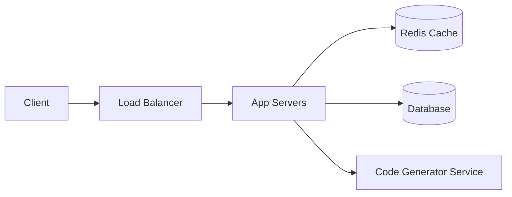
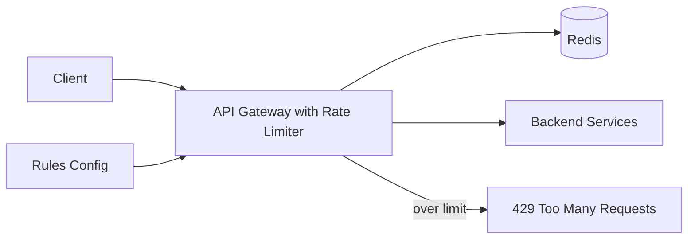
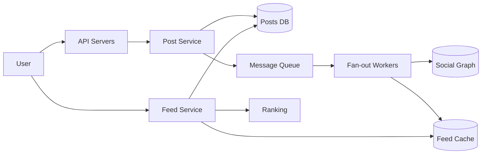
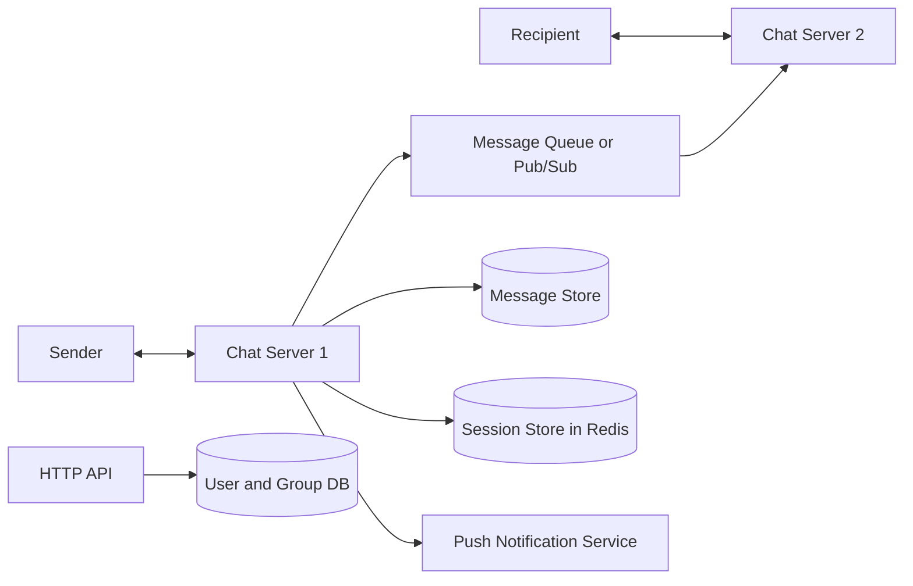
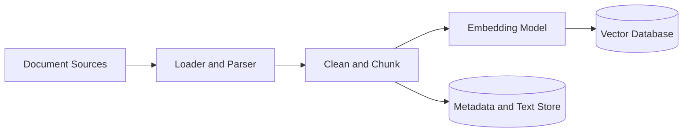
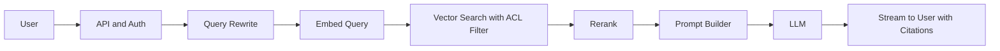

# System Design Case Studies

Worked designs for the classic problems, plus quick summaries for 15 more. Each full walkthrough follows the [interview framework](INTERVIEW_GUIDE.md): requirements, estimates, API, data model, high-level design, deep dives, and wrap-up.

**How to use this file:** pick a problem, set a 40-minute timer, and design it yourself on paper first. Only then read the solution and compare. Reading without attempting teaches far less.

All numbers are rough assumptions to show the method. In an interview, state your own assumptions.

## Contents

**Full walkthroughs**
1. [Design a URL shortener](#1-design-a-url-shortener)
2. [Design a rate limiter](#2-design-a-rate-limiter)
3. [Design a news feed](#3-design-a-news-feed)
4. [Design a chat application](#4-design-a-chat-application)
5. [Design a RAG chatbot](#5-design-a-rag-chatbot)

**More problems (summaries)**
6. [Problem summaries](#6-more-problems-summaries)
7. [Common patterns across problems](#7-common-patterns-across-problems)
8. [Template for your own write-ups](#8-template-for-your-own-write-ups)

---

## 1. Design a URL shortener

Examples: bit.ly, TinyURL.

### Requirements

**Functional**
- Given a long URL, create a unique short URL.
- Visiting the short URL redirects to the original.
- Optional: custom alias, expiration time.

**Non-functional**
- Very high availability for redirects.
- Low latency redirects (under 100 ms).
- Short codes should not be easy to guess in sequence.
- Links must be durable.

**Out of scope:** analytics dashboards, user accounts (mention how to add them).

### Estimates

- 100 million new URLs per month, which is about 40 writes per second.
- Read to write ratio 100 to 1, so about 4,000 redirects per second on average (peak maybe 10,000+).
- 5-year storage: 100M x 12 x 5 = 6 billion records. At about 500 bytes each, that's about 3 TB.
- Code length: 62 characters (a-z, A-Z, 0-9). 6 characters gives about 57 billion combinations. 7 characters gives about 3.5 trillion. Use 7.
- Cache: the hottest 20% of daily reads. 4,000 x 86,400 = about 350 million reads per day. 20% of that, times 500 bytes, is about 35 GB. Fits in a small Redis cluster.

Conclusion: read-heavy, modest storage. Caching does most of the work.

### API

```
POST /v1/urls
  body: { "long_url": "...", "custom_alias": "optional", "expires_at": "optional" }
  returns: { "short_url": "https://sho.rt/aZ3kP9x" }

GET /{short_code}
  returns: 302 Found, Location: <long_url>      (or 404 / 410 Gone if expired)
```

### Data model

| Field | Type | Notes |
| ----- | ---- | ----- |
| code | string (PK) | The 7-character short code |
| long_url | string | Original URL |
| created_at | timestamp | |
| expires_at | timestamp, nullable | |
| user_id | string, nullable | For owned links |

Access pattern: look up by `code`. This is a pure key-value lookup, so either a key-value store (DynamoDB, Cassandra) or a sharded relational table keyed by code works. A relational database is fine at this scale and simpler to start with.

### High-level design



**Create flow:** app server gets a unique code, stores `(code, long_url)` in the database, returns the short URL.

**Redirect flow:** app server checks Redis for `code`. On a hit, returns the redirect. On a miss, reads the database, fills the cache, and returns the redirect.

### Deep dive 1: generating unique codes

| Approach | How | Pros | Cons |
| -------- | --- | ---- | ---- |
| Hash and truncate | Hash the long URL (for example MD5), take the first 7 characters of the encoding | Same URL gives same code; no counter | Collisions; need to check and retry; truncation hurts uniqueness |
| Random code | Generate random 7 characters, check the DB, retry on collision | Unpredictable | Collision checks add DB reads; rate of collisions rises as the space fills |
| **Counter + base62** | Take a unique number and encode it in base62 | No collisions, simple | Sequential codes are guessable unless scrambled; needs a distributed counter |

**Chosen approach:** counter + base62, with these refinements:
- A **counter service** (backed by a replicated store or ZooKeeper/etcd) hands out **ranges** of IDs, for example 1,000,000 at a time, to each app server. Each server then assigns IDs locally with no coordination per request. If a server dies, its unused range is simply skipped.
- To avoid guessable sequences, **scramble the number** with a reversible permutation or encrypt it before encoding (for example, a block cipher over the integer, or a bijective shuffle of bits).
- Custom aliases are checked against the database with a unique constraint.

### Deep dive 2: scaling reads

- Redis cache-aside with LRU eviction and a TTL. Popular links stay hot.
- Cache "not found" results briefly so non-existent codes don't hammer the database (cache penetration).
- Database read replicas for cache misses.
- Optionally a CDN in front for extremely popular links.

### Deep dive 3: 301 vs 302

| | 301 (permanent) | 302 (temporary) |
| - | --------------- | --------------- |
| Browser caching | Cached, so repeat visits skip your server | Not cached, every visit hits your server |
| Load | Lower | Higher |
| Analytics | Lost for repeat visits | Every click is seen |
| Changing the target later | Hard (browsers remember) | Easy |

If you need click analytics or editable links, use 302. If you only care about load, 301.

### Deep dive 4: storage and expiry

- Shard by `hash(code)` once a single database is too small. Use consistent hashing or many virtual partitions for easy resharding.
- Expired links: check `expires_at` on read (lazy deletion) and run a background job to purge old rows.

### Extensions

- **Analytics:** on each redirect, push an event (code, timestamp, country, user agent) to Kafka. A consumer aggregates counts into an analytics store. This keeps the redirect path fast.
- **Abuse prevention:** rate limit link creation per user/IP, scan URLs against blocklists, and allow reporting.

### Wrap-up

- **SPOFs:** database (primary plus replicas with failover), cache (cluster; the database can survive a cold cache if requests are rate limited), counter service (replicated).
- **Monitor:** redirect latency (p99), cache hit rate, error rate, database load.
- **At 10x scale:** more cache nodes, shard the database, multiple regions with geo-routing.

---

## 2. Design a rate limiter

Used to protect APIs from abuse and overload, and to enforce fair use.

### Requirements

**Functional**
- Limit requests per client (user ID, API key, or IP) over a time period, for example 100 requests per minute.
- Support different limits per endpoint or customer tier.
- Reject excess requests with a clear response.

**Non-functional**
- Very low added latency (a few milliseconds).
- Works across many servers (distributed).
- Highly available. A limiter failure shouldn't take down the API.
- Accurate enough that limits are meaningful.

### Where to put it

| Location | Pros | Cons |
| -------- | ---- | ---- |
| Client-side | Cheap | Easy to bypass; unreliable |
| In each service | Fine-grained | Duplicated logic; inconsistent |
| **API gateway / middleware** | Central, consistent, protects all services | Must be fast and highly available |

Choose the gateway or a middleware layer, backed by a shared store.

### Algorithm choice

Compare the main algorithms (details in [FUNDAMENTALS.md](FUNDAMENTALS.md#14-api-design)):

| Algorithm | Notes |
| --------- | ----- |
| Token bucket | Allows bursts, simple, widely used. Good default. |
| Leaky bucket | Smooths traffic to a constant rate. |
| Fixed window counter | Simplest. Can allow up to 2x the limit at window boundaries. |
| Sliding window log | Accurate, memory heavy. |
| Sliding window counter | Good accuracy and low memory. |

**Chosen:** token bucket for most APIs (bursts are normal and acceptable), or sliding window counter when strict smoothness matters.

### Design



**Flow**
1. Request arrives at the gateway. Identify the client (API key, user ID, or IP).
2. Look up the matching rule (for example, 100 per minute for the free tier on this endpoint).
3. Check and update the counter or bucket in Redis.
4. If within the limit, forward the request. Otherwise return HTTP **429 Too Many Requests**.

**Response headers** (helpful to clients): `X-RateLimit-Limit`, `X-RateLimit-Remaining`, `Retry-After`.

### Token bucket in Redis

Store per client: `tokens` and `last_refill_time`. On each request:
1. Compute elapsed time since `last_refill_time`.
2. Add `elapsed x refill_rate` tokens, capped at bucket capacity.
3. If at least 1 token, subtract 1 and allow. Otherwise reject.

### Deep dive: race conditions

With many gateway servers, two requests can read the same counter and both decide to allow, exceeding the limit. The read-modify-write must be **atomic**.

Options:
- A **Lua script** executed in Redis (runs atomically) that does the whole check-and-update.
- Atomic commands such as `INCR` with `EXPIRE` for fixed windows.
- Sorted sets for sliding window logs, wrapped in a Lua script or a transaction.

### Deep dive: scaling and multi-region

- Shard Redis by client ID (consistent hashing). Each client's counter lives on one node.
- For multi-region, either keep limits per region (simple, slightly inaccurate globally) or sync counters asynchronously. Perfect global accuracy costs latency. Usually per-region limits with a slightly higher total are acceptable.
- To reduce Redis load, use a small **local in-memory counter** with periodic sync for very high-volume clients (approximate but fast).

### Deep dive: failure behaviour

If Redis is unavailable, choose:
- **Fail open** (allow requests): the API stays up but unprotected. Usually right for general APIs.
- **Fail closed** (reject): protects the backend but causes an outage. Use only where abuse protection is critical (for example, login attempts).

### Wrap-up

- **Monitor:** rejection rate per rule, Redis latency, rules that trigger most often.
- **Rule management:** store rules in a config service, cache them locally, and refresh periodically.
- **Edge cases:** clients behind shared IPs (NAT) may be unfairly limited, so prefer API keys or user IDs where available.

---

## 3. Design a news feed

Examples: the home timeline in Facebook, Instagram, or Twitter/X.

### Requirements

**Functional**
- Users create posts (text, images, video).
- Users follow other users.
- A user's home feed shows recent posts from people they follow, ranked.

**Non-functional**
- Very fast feed loads (under 200 ms).
- Highly available.
- Eventual consistency is acceptable: a new post can take a few seconds to appear.
- Handles users with millions of followers.

**Out of scope:** comments, likes, ads, detailed ranking models.

### Estimates

- 300 million monthly users, 100 million DAU.
- Each user opens the feed about 10 times a day: 1 billion feed reads per day, about 12,000 per second (peak 3 to 5 times that).
- 50 million new posts per day: about 600 writes per second.
- Average user follows 200 accounts. Some have more than 10 million followers.
- Read-to-write is very high, so **pre-compute feeds** and cache them.

### API

```
POST /v1/posts            body: { text, media_ids[] }                      -> { post_id }
POST /v1/follow           body: { followee_id }
GET  /v1/feed?cursor=...&limit=20                                          -> { posts[], next_cursor }
```

Use cursor pagination for the feed.

### Data model

| Store | Data | Technology |
| ----- | ---- | ---------- |
| Posts | post_id, author_id, text, media URLs, created_at | Sharded database (by post_id or author_id) |
| Social graph | follower_id, followee_id (both directions indexed) | Sharded relational or graph/key-value store |
| Feed cache | user_id -> list of post_ids (most recent N, for example 500) | Redis lists or sorted sets |
| Media | Images and video | Object storage + CDN |

### Core question: fan-out on write or on read?

| | Fan-out on write (push) | Fan-out on read (pull) |
| - | ----------------------- | ---------------------- |
| When a user posts | Write the post ID into every follower's feed cache | Just store the post |
| When a user reads | Read their pre-built feed (fast) | Fetch recent posts from everyone they follow, merge, rank (slow) |
| Pros | Very fast reads | Cheap writes; no wasted work |
| Cons | Heavy write amplification for users with many followers; wasted work for inactive users | Slow reads, expensive at read time |

**Hybrid approach (what large systems use):**
- **Push** for normal users (fewer than, say, 10,000 followers): pre-build followers' feeds.
- **Pull** for celebrities: don't fan out their posts. When a user reads their feed, fetch the pre-built feed and merge in recent posts from the celebrities they follow.
- Skip fan-out for **inactive** users, and build their feed on demand when they return.

### High-level design



**Post flow**
1. User creates a post. The Post Service saves it and publishes a "new post" event to a queue.
2. Fan-out workers read the event, fetch the author's followers from the social graph, and push the post ID into each follower's feed cache (trimming to the latest N).

**Read flow**
1. Feed Service reads the user's list of post IDs from the feed cache.
2. For celebrity accounts they follow, it fetches recent posts and merges them.
3. It hydrates the IDs into full posts (from a posts cache or database), applies ranking, and returns a page.

### Deep dives

**Ranking:** start with reverse chronological order. Later, add a ranking service that scores posts using signals such as recency, relationship strength, and engagement. Ranking is usually done on the candidate set at read time.

**Hot posts and caching:** cache post objects and user profiles separately (they are read far more often than the feed list). Hot posts are served from cache and, for media, from the CDN.

**Pagination:** cursor-based (the ID or timestamp of the last item) so pages stay stable as new posts arrive.

**Social graph storage:** needs fast "who follows X" and "who does X follow". Store both directions, sharded by user ID. A celebrity's follower list is huge, so it is paginated and read in chunks by workers.

**Media:** clients upload directly to object storage using pre-signed URLs. Processing (thumbnails, transcoding) runs asynchronously via a queue. Serve through a CDN.

**Failure and consistency:** if the fan-out lags or a worker fails, the post appears a little late. This is acceptable (eventual consistency). Make workers idempotent so retries don't duplicate entries.

### Wrap-up

- **Bottlenecks:** fan-out throughput for popular users (solved by the hybrid), hot keys in the feed cache.
- **Monitor:** fan-out lag, feed read latency, cache hit rate.
- **At 10x:** shard the feed cache by user ID, add more workers, partition queues by author or follower ranges.

---

## 4. Design a chat application

Examples: WhatsApp, Slack, Messenger.

### Requirements

**Functional**
- One-to-one messaging.
- Group chats (up to a few hundred members).
- Online/offline presence.
- Delivery and read receipts.
- Message history across devices.
- Push notifications for offline users.

**Non-functional**
- Low latency delivery (under a second) when both are online.
- Messages must never be lost.
- Messages in a conversation appear in order.
- Highly available.

**Out of scope:** end-to-end encryption internals, voice/video calls.

### Estimates

- 500 million DAU, each sending 40 messages per day: 20 billion messages per day, about 230,000 per second on average.
- 100 bytes per message: about 2 TB per day, about 730 TB per year.
- Each connected user holds a persistent connection. If one server handles about 100,000 connections, 50 million concurrent users need about 500 servers.

Conclusion: huge write volume, enormous number of persistent connections, append-only message data. Wide-column storage and WebSockets fit well.

### Communication protocol

Use **WebSockets** for persistent two-way connections. Use HTTP for non-real-time actions (login, fetching history, uploading media). Fall back to long polling if WebSockets are blocked.

### High-level design



### Message flow (1:1)

1. Sender's client sends the message over its WebSocket to Chat Server 1.
2. The server assigns a message ID, **persists the message** to the message store, and acknowledges to the sender (one tick).
3. The server looks up which chat server the recipient is connected to (session store).
4. **If online:** it routes the message to that server (via pub/sub or direct call), which pushes it down the recipient's WebSocket. The recipient's client acknowledges (delivered, two ticks).
5. **If offline:** the message stays in the store, and the push notification service sends a mobile notification. When the user reconnects, the client syncs messages after its last-seen message ID.

### Data model and storage

| Data | Store | Why |
| ---- | ----- | --- |
| Users, groups, memberships | Relational DB | Structured, moderate size, needs consistency |
| Messages | Wide-column store (Cassandra/HBase style) | Massive append-heavy writes, queried by conversation and time |
| Online sessions (user to server) | Redis | Fast lookups, short-lived data |

**Message table:** partition key = `conversation_id`, clustering key = `message_id` (time-ordered). That makes "fetch the latest N messages in this chat" a fast, sequential read of one partition.

### Message IDs and ordering

Messages in a conversation must be ordered. Options:
- A **per-conversation sequence number** from the server handling that conversation. Simple and gives strict order within a chat.
- A **time-sortable global ID** (Snowflake-style). Order is by time, with possible small ambiguity between clocks.

Ordering across different conversations doesn't matter. Per-conversation ordering is enough.

### Group chat

- **Small groups** (up to a few hundred): fan-out on write. The message is stored once, and the server delivers it to each member's connected server (or marks it for offline members). Deliver by looking up members and routing to each one's session.
- **Large groups/channels** (thousands+): avoid per-member fan-out writes. Store once and have clients pull, or use topic-based pub/sub so each connected chat server subscribes once per channel.

### Presence (online/offline)

- Clients send **heartbeats** every few seconds. The server stores `last_seen` in Redis with a TTL.
- If heartbeats stop, the user is marked offline after the TTL.
- Don't broadcast every status change to all contacts (a storm of events). Fetch presence on demand for the visible chat, or push only to users currently viewing that contact.

### Deep dives

**Reliability and delivery guarantees:** at-least-once delivery with **client acknowledgements** and client-side de-duplication by message ID. The server retries until it receives an ack. The message is persisted before acknowledging to the sender, so it is never lost.

**Connection management:** a gateway layer of stateful WebSocket servers behind a load balancer. Because connections are long-lived, deployments need graceful draining and clients need automatic reconnection with backoff and jitter.

**Multi-device sync:** each device tracks its last-seen message ID per conversation and syncs from there. Messages are stored per conversation, not per device.

**Media:** upload to object storage (pre-signed URL), send only the media URL and metadata in the message, serve through a CDN.

**Scaling:** shard messages by conversation ID. Partition the session store and pub/sub by user ID. Add chat servers horizontally.

### Wrap-up

- **Failure:** if a chat server dies, its clients reconnect to another and sync missed messages. Messages are in the store, so none are lost.
- **Monitor:** connection count, message delivery latency, undelivered backlog, reconnect rate.
- **Security:** TLS everywhere, authentication on connect, and end-to-end encryption if required.

---

## 5. Design a RAG chatbot

A chatbot that answers questions using a company's own documents, by retrieving relevant passages and giving them to a large language model (LLM). Examples: an internal knowledge assistant, a customer support bot, a "chat with your docs" product.

### Requirements

**Functional**
- Users upload or connect documents (PDFs, wikis, tickets).
- Users ask questions in natural language and get answers grounded in those documents, with source citations.
- Answers stream back token by token.
- Users only see answers from documents they are allowed to access.

**Non-functional**
- First token in about 1 to 2 seconds.
- Answers should be accurate and grounded, with minimal hallucination.
- Documents are kept reasonably fresh.
- Cost-aware: LLM calls are the most expensive part.

**Out of scope:** model training, fine-tuning.

### Estimates

- 1 million documents, average 20 chunks each: 20 million chunks.
- Each chunk has an embedding of about 1,536 floats (4 bytes each), about 6 KB. 20M x 6 KB is about 120 GB of vectors (plus the text and metadata). A single vector database cluster can hold this.
- 100,000 queries per day, about 1 query per second average (peak 10+).
- Each query sends perhaps 3,000 to 6,000 tokens to the LLM. LLM latency and cost dominate, not storage.

### Two pipelines

**1. Ingestion (offline / asynchronous)**



1. **Load and parse** documents (PDF text extraction, HTML cleaning, OCR if needed).
2. **Chunk** into passages (for example 200 to 500 tokens with some overlap). Chunking quality heavily affects answer quality. Respect headings and paragraphs where possible.
3. **Embed** each chunk with an embedding model.
4. **Store** the vector plus metadata (document ID, title, source URL, access-control info, timestamps) in a vector database, and the text in a regular store.
5. Run this as a queue-driven pipeline so uploads don't block, with retries and idempotency (re-ingesting the same document replaces its old chunks).

**2. Query (online)**



1. **Authenticate** the user and determine which documents they can access.
2. **Rewrite the query** if needed (for example, turn a follow-up like "what about pricing?" into a standalone question using chat history).
3. **Embed** the query.
4. **Retrieve** the top-K similar chunks from the vector database, **filtered by access permissions**. Combine with keyword search (BM25) for **hybrid retrieval**, which catches exact terms such as product codes that embeddings can miss.
5. **Rerank** the candidates with a cross-encoder or reranking model to keep the best few.
6. **Build the prompt:** instructions, retrieved chunks (with source IDs), recent conversation, and the question. Tell the model to answer only from the context and to say when it doesn't know.
7. **Call the LLM** and **stream** the response to the user, returning citations that point to the source chunks.

### Deep dives

**Retrieval quality:** most RAG failures are retrieval failures, not model failures. Levers: better chunking, hybrid search, reranking, query rewriting, metadata filters, and tuning K. Measure retrieval separately (is the right chunk in the top K?).

**Access control:** store permissions as metadata on each chunk and filter at query time. Never rely on the model to hide information. Filtering must happen before text reaches the prompt.

**Freshness:** use change detection (webhooks, CDC, or periodic crawls) to re-ingest changed documents incrementally. Delete old chunks when documents are deleted.

**Latency budget (example):** query embedding 50 ms, vector search 50 ms, rerank 100 to 200 ms, LLM time to first token 500 to 1,500 ms. Streaming hides most of the generation time. Run independent steps in parallel where possible.

**Cost control:**
- **Cache** embeddings and, where acceptable, full answers (including a **semantic cache** that matches similar questions).
- Limit context size and K.
- Route simple questions to a smaller, cheaper model.
- Rate limit per user and per tenant.

**Evaluation and quality:**
- Build a test set of questions with expected answers or expected source documents.
- Track retrieval metrics (recall at K), answer faithfulness (is it supported by the sources?), and user feedback (thumbs up/down).
- Log queries, retrieved chunks, and answers for debugging (with privacy controls).

**Safety and guardrails:** defend against prompt injection in documents (treat retrieved text as untrusted data), filter sensitive output, and add moderation if the product is public-facing.

**Scaling:**
- Vector database: shard and replicate. Use approximate nearest-neighbour indexes (HNSW or IVF).
- Stateless API servers behind a load balancer.
- Ingestion workers scale with queue depth.
- LLM calls: use provider rate limits and queueing, with graceful degradation (smaller model, shorter context) when overloaded.

### Wrap-up

- **Failure modes:** LLM provider outage (fallback model or friendly error), vector database slowness (timeouts and cached results), bad ingestion (dead-letter queue and re-processing).
- **Monitor:** time to first token, retrieval recall, answer feedback, cost per query, ingestion lag.
- **Next steps:** conversation memory, multi-turn tools (agents), per-tenant isolation, and fine-grained evaluation pipelines.

For the AI side in depth, see the [AI/ML/LLM roadmap](https://github.com/DivaQueen-dev/free-ai-ml-llm-roadmap).

---

## 6. More problems (summaries)

Try each one yourself first. These summaries show the core challenge, the key components, and the key decisions, so you can check your own design.

| # | Problem | Core challenge | Key components and ideas | Key trade-offs and decisions |
| - | ------- | -------------- | ------------------------ | ---------------------------- |
| 1 | **Notification system** | Deliver millions of push, SMS, and email messages reliably without duplicates | Notification API, templates, per-channel queues and workers, third-party providers (APNs, FCM, email/SMS gateways), user preferences, retry with backoff, dead-letter queue, idempotency keys, rate limiting per user | At-least-once with dedupe vs at-most-once; priority queues for urgent messages; handling provider failures with fallbacks |
| 2 | **Web crawler** | Crawl billions of pages politely and without repeats | URL frontier (priority and politeness queues), fetchers, DNS cache, parser, duplicate detection (hashing, Bloom filter), robots.txt handling, storage in object store, distributed workers | Breadth-first vs priority crawling; politeness per domain; avoiding spider traps; freshness vs coverage |
| 3 | **Search autocomplete (typeahead)** | Return top suggestions in a few milliseconds as the user types | Trie or prefix index storing top-K per prefix, aggregated query logs, offline job to rebuild popular completions, caching, sharding by prefix, CDN or edge caching | Freshness (trending queries) vs build cost; personalisation vs cache hit rate; memory vs latency |
| 4 | **Distributed cache** | A fast, scalable, highly available key-value cache | Consistent hashing with virtual nodes, replication, eviction (LRU), client library or proxy for routing, TTLs, hot-key handling, cluster membership via gossip or coordinator | Consistency vs availability; replication cost; handling node failure and rebalancing |
| 5 | **Key-value store (Dynamo-style)** | Highly available, scalable storage with tunable consistency | Consistent hashing, N/R/W quorums, replication, vector clocks or last-write-wins, hinted handoff, read repair, anti-entropy (Merkle trees), gossip, LSM-tree storage | CAP choices; conflict resolution; tunable quorum settings |
| 6 | **Unique ID generator** | Globally unique, roughly time-ordered 64-bit IDs without a bottleneck | Snowflake: timestamp, machine ID, sequence bits; machine ID assignment via ZooKeeper/etcd; clock-skew handling | Coordination vs independence; clock drift risk; ID size and sortability |
| 7 | **File storage and sync (Dropbox/Drive)** | Sync large files across devices efficiently and consistently | Split files into chunks (block-level), hash each chunk, upload only changed chunks, metadata DB, object storage, change notification (long poll or WebSocket), versioning, conflict handling, deduplication | Chunk size; conflict resolution policy; bandwidth savings vs complexity; consistency of metadata |
| 8 | **Video streaming (YouTube/Netflix)** | Store and deliver huge videos smoothly to varied devices | Upload to object storage, transcoding pipeline (queues and workers) into multiple resolutions and formats, adaptive bitrate streaming (HLS/DASH), CDN, metadata DB, recommendations | CDN cost vs latency; pre-transcode everything vs on demand; popularity-based caching at edges |
| 9 | **Ride sharing (Uber/Ola)** | Match riders to nearby drivers in real time using live locations | Location ingestion (frequent updates), geospatial index (geohash, quadtree, or S2 cells), in-memory store for driver locations, matching service, trip state machine, WebSockets for updates, surge pricing service | Update frequency vs load; matching quality vs speed; consistency for trip assignment (avoid double-assigning a driver) |
| 10 | **Ticket booking (BookMyShow/IRCTC-style)** | Prevent double booking under heavy concurrent demand | Seat inventory in a relational DB, temporary seat holds with expiry (TTL), pessimistic row locks or optimistic versioning, payment flow, queue or waiting room for flash sales, idempotent payment callbacks | Strong consistency for seats vs throughput; hold timeout length; fairness during spikes |
| 11 | **Payment system** | Never lose or double-charge money | Payment API with idempotency keys, ledger (double-entry, append-only), integration with payment gateways, state machine for payments, reconciliation jobs, retries, saga across services, audit logs | Strong consistency and durability over availability; exactly-once effects via idempotency; handling uncertain gateway responses |
| 12 | **Leaderboard** | Show real-time rankings for millions of players | Redis sorted sets (ZADD, ZRANK, ZREVRANGE), periodic snapshots to a database, sharding by score range or game, top-N cache | Exact vs approximate rank for huge user counts; memory cost; time-bucketed boards (daily, weekly) |
| 13 | **Food delivery (Swiggy/Zomato)** | Match orders, restaurants, and delivery partners with live tracking | Restaurant search with geo filter and ranking, order state machine, dispatch and assignment service, live location tracking, ETA estimation, notification, payment, surge/demand balancing | Assignment speed vs optimal matching; real-time location load; consistency of order state |
| 14 | **Metrics and logging system** | Ingest massive telemetry and query it quickly | Agents on hosts, Kafka for buffering, stream processing and aggregation, time-series DB for metrics, search or columnar store for logs, retention and downsampling, alerting | Resolution vs storage cost; ingestion reliability; query latency vs retention length |
| 15 | **Collaborative document editor (Google Docs)** | Multiple people editing the same document in real time without conflicts | WebSocket sessions per document, operational transformation (OT) or CRDTs to merge concurrent edits, document server per active doc, operation log with periodic snapshots, presence and cursors | OT vs CRDT complexity; server-ordered vs peer-merged edits; offline editing support |

---

## 7. Common patterns across problems

After a handful of case studies, you'll notice the same moves repeating. These are the real takeaways:

| Pattern | Seen in | Idea |
| ------- | ------- | ---- |
| **Cache hot reads** | URL shortener, feed, autocomplete, RAG | Put the most-read data in memory in front of the database. |
| **Queue slow or bursty work** | Notifications, feed fan-out, video transcoding, RAG ingestion | Respond fast and process asynchronously with retries. |
| **Shard by the main access key** | URL shortener (code), chat (conversation), feed (user) | Pick the key that keeps most queries on one shard. |
| **Push vs pull (fan-out)** | News feed, notifications, large chat groups | Pre-compute for common cases; compute on demand for extremes. |
| **Idempotency everywhere** | Payments, queues, ingestion, chat delivery | Make retries safe. |
| **Object storage plus CDN for media** | Feed, chat, video, file sync | Never store large blobs in your main database. |
| **Separate hot path from analytics** | URL shortener, metrics | Emit events to a stream; process off the critical path. |
| **Hot key mitigation** | Celebrities, viral content, hot cache keys | Replicate, split, or locally cache the hot item. |
| **Eventual consistency where harmless** | Feeds, likes, search indexes | Accept small delays for big scalability gains. |
| **Strong consistency where it matters** | Payments, booking, inventory | Use transactions, locks, or consensus-backed stores. |
| **Graceful degradation** | All | Serve something useful when a dependency is down. |

---

## 8. Template for your own write-ups

Copy this for every problem you practise. Filling it in forces clarity.

```
# Design: <system name>

## Requirements
Functional:
-
Non-functional:
-
Out of scope:
-

## Estimates
Users / DAU:
Read QPS / Write QPS (avg, peak):
Storage (per day, total):
Bandwidth:
What the numbers imply:

## API
-

## Data model
Entities and key fields:
Main access patterns:
Database choice and why:

## High-level design
(diagram)
Main flow 1:
Main flow 2:

## Deep dives
1.
2.
3.

## Trade-offs I made
-

## Failure scenarios
-

## Monitoring
-

## What changes at 10x scale
-

## What I missed (after comparing with a reference)
-
```
