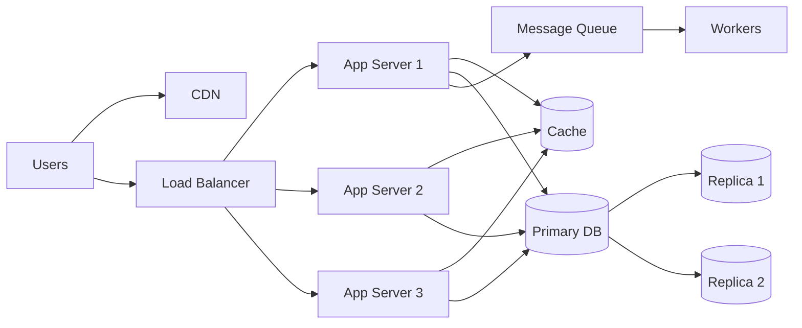
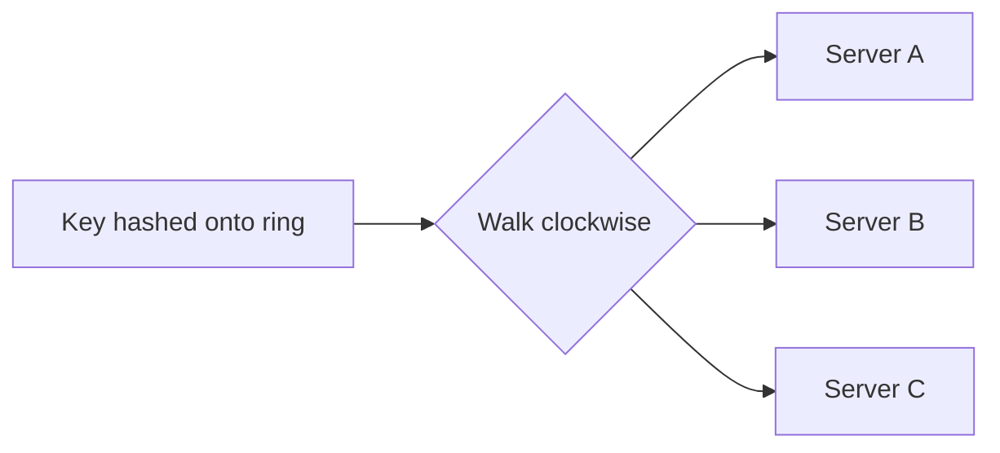

# System Design Fundamentals

Every core building block, explained in plain language with the trade-offs that matter. Read it in order the first time. After that, use it as a reference.

For each topic you'll find: what it is, why it exists, how it works, and when to use it (or avoid it).

## Contents

1. [Core vocabulary](#1-core-vocabulary)
2. [Scaling](#2-scaling)
3. [Back-of-envelope estimation](#3-back-of-envelope-estimation)
4. [Networking and communication](#4-networking-and-communication)
5. [Load balancing and proxies](#5-load-balancing-and-proxies)
6. [Caching](#6-caching)
7. [Content delivery networks](#7-content-delivery-networks)
8. [Databases](#8-databases)
9. [Replication](#9-replication)
10. [Partitioning and sharding](#10-partitioning-and-sharding)
11. [CAP, PACELC, and consistency models](#11-cap-pacelc-and-consistency-models)
12. [Messaging and event streaming](#12-messaging-and-event-streaming)
13. [Storage, search, and vector databases](#13-storage-search-and-vector-databases)
14. [API design](#14-api-design)
15. [Reliability patterns](#15-reliability-patterns)
16. [Distributed systems concepts](#16-distributed-systems-concepts)
17. [Architecture styles and patterns](#17-architecture-styles-and-patterns)
18. [Data processing](#18-data-processing)
19. [Observability](#19-observability)
20. [Security basics](#20-security-basics)
21. [Probabilistic data structures](#21-probabilistic-data-structures)
22. [Decision cheat sheet](#22-decision-cheat-sheet)

---

## 1. Core vocabulary

| Term | Meaning | Example |
| ---- | ------- | ------- |
| **Latency** | Time for one request to complete. | A page loads in 200 ms. |
| **Throughput** | How much work is done per unit time. | 5,000 requests per second. |
| **Bandwidth** | Maximum data that can move through a link per unit time. | 1 Gbps network link. |
| **Scalability** | Ability to handle growth in load by adding resources. | Going from 1,000 to 1,000,000 users. |
| **Availability** | Fraction of time the system is up and working. | 99.99% uptime. |
| **Reliability** | System does the right thing, even when parts fail. | Order is never lost even if a server crashes. |
| **Durability** | Once data is saved, it stays saved. | A confirmed payment is not lost after a power cut. |
| **Consistency** | All users see the same data at the same time. | After updating a profile, every device shows the new name. |
| **Fault tolerance** | Continues operating when components fail. | One database node dies, service keeps running. |
| **Single point of failure (SPOF)** | A component whose failure takes the whole system down. | One load balancer with no backup. |

### Latency vs throughput

Latency is how long one thing takes. Throughput is how many things you finish per second. They are related but not the same. A highway with many lanes has high throughput, but each car still takes the same time to arrive.

Optimising for one can hurt the other. Batching requests raises throughput but adds latency to each request.

### Percentiles matter more than averages

Averages hide problems. If 99 requests take 50 ms and 1 takes 5 seconds, the average looks fine, but 1% of users have a terrible experience.

| Metric | Meaning |
| ------ | ------- |
| p50 (median) | Half of requests are faster than this. |
| p95 | 95% are faster. 1 in 20 is slower. |
| p99 | 99% are faster. 1 in 100 is slower. |

Large systems care about p99 because a single user action often triggers many backend calls, and the slowest one decides the overall time.

### Availability and the nines

| Availability | Downtime per year | Downtime per month |
| ------------ | ----------------- | ------------------ |
| 99% (two nines) | about 3.65 days | about 7.3 hours |
| 99.9% (three nines) | about 8.8 hours | about 44 minutes |
| 99.99% (four nines) | about 53 minutes | about 4.4 minutes |
| 99.999% (five nines) | about 5.3 minutes | about 26 seconds |

When components are in series (all must work), availability multiplies and gets worse. When they are in parallel (any one can serve), availability improves. This is why redundancy helps.

### SLI, SLO, SLA

- **SLI** (indicator): a measurement, such as the fraction of requests that succeed.
- **SLO** (objective): your internal target, such as 99.9% of requests succeed over 30 days.
- **SLA** (agreement): a contract with customers, often with penalties if missed. SLAs are usually looser than SLOs.

---

## 2. Scaling

### Vertical vs horizontal

| | Vertical scaling (scale up) | Horizontal scaling (scale out) |
| - | --------------------------- | ------------------------------ |
| What | Bigger machine: more CPU, RAM, disk | More machines |
| Pros | Simple. No code changes. | Near-unlimited growth. Fault tolerant. |
| Cons | Hard limit. Expensive at the top end. Still a SPOF. | Needs load balancing, data distribution, more complexity. |
| Use when | Early stage, or the component is hard to distribute (a single database) | You need to grow beyond one machine or need high availability |

### Stateless vs stateful

A **stateless** server keeps no per-user data between requests. Any server can handle any request, so you can add or remove servers freely behind a load balancer.

A **stateful** server remembers things (sessions, uploaded files in local disk). That makes scaling and failover harder.

Rule of thumb: keep application servers stateless and push state into shared stores (databases, caches, object storage). For sessions, either use signed tokens (such as JWT) or a shared session store (such as Redis).

### Typical scaling journey

1. **One server** runs the app and the database.
2. **Separate the database** from the app server.
3. **Add a load balancer** and several stateless app servers.
4. **Add a cache** to reduce database reads.
5. **Add read replicas** to scale reads.
6. **Add a CDN** for static content and media.
7. **Use message queues** to move slow work out of the request path.
8. **Shard the database** when a single primary can't handle the writes or data size.
9. **Go multi-region** for lower latency and disaster tolerance.

Don't jump to step 9 for a system that needs step 3. In interviews and real life, scale in response to numbers.

---

## 3. Back-of-envelope estimation

Estimation tells you whether you need one server or a hundred, and whether the bottleneck is storage, bandwidth, or requests per second. Round aggressively. Being within a factor of 2 to 3 is fine.

### Numbers to remember

**Time**

| Fact | Value |
| ---- | ----- |
| Seconds in a day | 86,400 (round to about 100,000, or 10^5) |
| Seconds in a month | about 2.6 million |
| Seconds in a year | about 31.5 million |

**Data sizes**

| Unit | Bytes |
| ---- | ----- |
| 1 KB | 10^3 |
| 1 MB | 10^6 |
| 1 GB | 10^9 |
| 1 TB | 10^12 |
| 1 PB | 10^15 |

**Latency (order of magnitude)**

| Operation | Approximate time |
| --------- | ---------------- |
| Memory reference | 100 nanoseconds |
| Read 1 MB from memory | tens to hundreds of microseconds |
| SSD random read | about 100 microseconds |
| Round trip within a data centre | about 0.5 milliseconds |
| Read 1 MB from SSD | about 1 millisecond |
| Hard disk seek | about 10 milliseconds |
| Round trip across continents | 100 to 150 milliseconds |

Key takeaways: memory is roughly 1,000 times faster than SSD for random reads, SSD is much faster than a disk seek, and network trips across regions are slow. This is why caching and data locality matter. See [Latency Numbers Every Programmer Should Know](https://gist.github.com/jboner/2841832) and the [interactive version](https://colin-scott.github.io/personal_website/research/interactive_latency.html).

**Rough capacity (very approximate; depends on hardware and workload)**

| Component | Order of magnitude |
| --------- | ------------------ |
| One web/app server | hundreds to a few thousand requests per second |
| One relational database instance | thousands to tens of thousands of simple queries per second |
| One Redis instance | up to roughly 100,000 operations per second |
| One Kafka broker | hundreds of thousands of messages per second |

Use these only as starting points. State your assumption out loud.

### The estimation recipe

1. **Users**: total users, daily active users (DAU).
2. **Actions per user per day**: reads and writes.
3. **QPS (queries per second)** = total daily requests / 86,400. Peak is often 2 to 5 times the average.
4. **Storage** = items per day x size per item x retention period.
5. **Bandwidth** = QPS x average response size.
6. **Memory for cache**: often use the 80/20 rule. Cache the hottest 20% of daily data.

### Worked example: a Twitter-like service

Assumptions:
- 300 million monthly active users, 100 million DAU
- Each user reads 100 tweets per day and posts 0.5 tweets per day
- Average tweet is 300 bytes of text. 10% have a 500 KB image.

Reads: 100M x 100 = 10 billion per day, which is about 10^10 / 10^5 = 100,000 reads per second on average. Peak maybe 300,000 per second.

Writes: 100M x 0.5 = 50 million per day, which is about 500 writes per second.

Read-to-write ratio: 200 to 1, so this is heavily read-dominated. That points to caching, read replicas, and pre-computed timelines.

Storage per day: text is 50M x 300 B = 15 GB. Images are 5M x 500 KB = 2.5 TB. Images dominate. Per year that is about 900 TB of images, so use object storage plus a CDN.

Conclusion from the numbers: heavy reads, image-dominated storage, and moderate write volume. This shapes the whole design.

---

## 4. Networking and communication

### What happens when you open a URL

1. The browser checks its cache, then asks the OS, then a DNS resolver for the IP address of the domain.
2. The browser opens a TCP connection to that IP (plus a TLS handshake for HTTPS).
3. It sends an HTTP request.
4. The request may hit a CDN, then a load balancer, then an application server.
5. The server may query a cache and a database, then builds a response.
6. The response travels back and the browser renders it.

### DNS

DNS translates names to IP addresses. It can also be used for load balancing (return different IPs) and for routing users to the nearest data centre (geo-DNS). Answers are cached according to a TTL, so changes take time to propagate.

### TCP vs UDP

| | TCP | UDP |
| - | --- | --- |
| Delivery | Reliable, ordered | Best effort, no ordering |
| Overhead | Connection setup, retransmissions | Very low |
| Use for | Web, databases, file transfer | Video calls, gaming, DNS lookups |

### HTTP versions

| Version | Key idea |
| ------- | -------- |
| HTTP/1.1 | One request at a time per connection (browsers open several connections). |
| HTTP/2 | Many requests multiplexed over one connection. Header compression. |
| HTTP/3 | Runs over QUIC (on UDP). Faster connection setup and better behaviour on lossy networks. |

### API styles

| Style | Best for | Notes |
| ----- | -------- | ----- |
| **REST** | Public APIs, CRUD, simple web and mobile backends | Resource-oriented URLs, standard HTTP verbs, easy to cache. |
| **GraphQL** | Clients that need flexible queries across many data sources | The client asks for exactly what it needs. Harder to cache and rate limit. |
| **gRPC** | Service-to-service calls inside a system | Binary (Protocol Buffers), fast, strongly typed, streaming support. |

### Real-time communication

| Technique | How it works | Use when |
| --------- | ------------ | -------- |
| **Short polling** | Client asks repeatedly every few seconds. | Simple, low-frequency updates. Wasteful otherwise. |
| **Long polling** | Client asks and the server holds the request until there is data or a timeout. | Moderate real-time needs, simple infrastructure. |
| **Server-Sent Events (SSE)** | One-way stream from server to client over HTTP. | Live feeds, notifications, streaming LLM output. |
| **WebSocket** | Persistent two-way connection. | Chat, collaborative editing, multiplayer games, live dashboards. |

WebSocket connections are stateful and long-lived, so each server holds a limited number of them. You need a way to find which server a user is connected to (a lookup in Redis or a pub/sub layer).

---

## 5. Load balancing and proxies

### Load balancer

A load balancer spreads incoming traffic across multiple servers. It improves capacity and availability, because it can route around failed servers using health checks.

### Layer 4 vs Layer 7

| | L4 (transport layer) | L7 (application layer) |
| - | -------------------- | ---------------------- |
| Looks at | IP addresses and ports | HTTP headers, URLs, cookies |
| Speed | Faster, simpler | Slower, more flexible |
| Can do | Forward TCP/UDP connections | Route by path or host, terminate TLS, rewrite headers, A/B routing |
| Example | AWS Network Load Balancer | Nginx, AWS Application Load Balancer, Envoy |

### Algorithms

| Algorithm | How it works | Good for |
| --------- | ------------ | -------- |
| Round robin | Take turns | Equal servers, similar requests |
| Weighted round robin | Bigger servers get more | Mixed server sizes |
| Least connections | Send to the server with the fewest active connections | Long-lived or uneven requests |
| IP hash | Hash client IP to pick a server | Simple session affinity |
| Consistent hashing | Hash a key onto a ring | Caches and sharded services (see section 10) |

### Sticky sessions

Sticky sessions send the same user to the same server. They are convenient but undermine stateless design: if the server dies, the session is lost. Prefer shared session storage.

### Making the load balancer itself reliable

A single load balancer is a SPOF. Run at least two, in active-passive or active-active mode, sharing a virtual IP or using DNS. Cloud load balancers do this for you.

### Reverse proxy vs forward proxy

- A **forward proxy** sits in front of clients (for example, a corporate proxy or VPN).
- A **reverse proxy** sits in front of servers. It handles TLS termination, caching, compression, rate limiting, and routing. Nginx and HAProxy are common.

### API gateway

An API gateway is a reverse proxy designed as the single entry point to many microservices. It handles authentication, rate limiting, routing, request aggregation, and logging, so each service doesn't have to.

### Service discovery

In a world of changing server addresses (containers, autoscaling), services need to find each other. Options: a registry (Consul, etcd, ZooKeeper), DNS-based discovery (Kubernetes services), or a client-side library with a registry.

---

## 6. Caching

A cache stores copies of data in faster storage so repeated reads are quick and the backing store is protected. Caching is the single most effective way to improve read performance.

### Where to cache

| Layer | Example | Notes |
| ----- | ------- | ----- |
| Client | Browser cache, mobile app cache | Fastest. Controlled by HTTP headers (Cache-Control, ETag). |
| CDN | Cloudflare, CloudFront | Static files and public content close to users. |
| Application | In-process memory | Fastest server-side but not shared across servers. |
| Distributed cache | Redis, Memcached | Shared by all app servers. The most common design choice. |
| Database | Query cache, buffer pool | Built in. |

### Caching strategies

| Strategy | How it works | Pros | Cons |
| -------- | ------------ | ---- | ---- |
| **Cache-aside (lazy loading)** | App checks cache; on miss, reads DB and fills cache. | Only caches what is used. Resilient to cache failure. | First request is slow. Data can go stale. |
| **Read-through** | Cache itself loads from DB on a miss. | Simpler app code. | Needs cache library support. |
| **Write-through** | Writes go to cache and DB together. | Cache stays fresh. | Slower writes. Caches data that may never be read. |
| **Write-behind (write-back)** | Write to cache, flush to DB later. | Very fast writes. | Risk of data loss if the cache fails. |
| **Write-around** | Write to DB only; cache fills on read. | Avoids polluting cache with rarely-read data. | Read after write is a miss. |

Cache-aside is the default choice in most designs.

### Eviction policies

| Policy | Evicts |
| ------ | ------ |
| LRU (least recently used) | The item not used for the longest time. The most common choice. |
| LFU (least frequently used) | The item used least often. |
| FIFO | The oldest item. |
| TTL (time to live) | Items after a set time. Often combined with the above. |

### Cache invalidation

"There are only two hard things in computer science: cache invalidation and naming things." Options:

- **TTL**: simple, accepts some staleness.
- **Explicit invalidation**: delete or update the cache entry when the data changes. Accurate but easy to get wrong.
- **Versioned keys**: include a version number in the key so old entries just stop being used.

### Classic cache problems

| Problem | What happens | Fix |
| ------- | ------------ | --- |
| **Cache stampede (thundering herd)** | A popular key expires and thousands of requests hit the database at once. | Lock so only one request refreshes the value; stagger TTLs with random jitter; refresh ahead of expiry. |
| **Cache penetration** | Requests for keys that don't exist always miss and hit the DB. | Cache "not found" results briefly; use a Bloom filter to reject impossible keys. |
| **Cache avalanche** | Many keys expire at the same moment or the cache goes down. | Randomise TTLs; replicate the cache; protect the DB with rate limiting. |
| **Hot key** | One key gets a huge share of traffic and overloads one cache node. | Replicate the hot key across nodes; use a local in-process cache in front. |
| **Stale data** | Cache and DB disagree. | Shorter TTL, explicit invalidation, or accept eventual consistency where it is harmless. |

### What to cache

Good candidates: data that is read much more often than written, expensive to compute, or tolerant of slight staleness (profiles, product pages, feed lists, computed counts). Poor candidates: data that changes constantly or must always be exact (account balances during a transaction).

---

## 7. Content delivery networks

A CDN is a global network of servers (edge locations) that cache content close to users. Users download from a nearby edge instead of your distant origin server, which cuts latency and offloads traffic.

| | Pull CDN | Push CDN |
| - | -------- | -------- |
| How | Edge fetches from origin on the first request, then caches. | You upload content to the CDN in advance. |
| Pros | Simple. Only popular content is stored. | Full control. No first-request delay. |
| Cons | First request is slow. | More work. Good for content that rarely changes. |

Use a CDN for images, videos, JavaScript, CSS, downloads, and increasingly for cacheable API responses. Control freshness with cache headers and by changing file names (for example, `app.3f9a1c.js`) when content changes.

CDNs also absorb DDoS traffic and terminate TLS near users.

---

## 8. Databases

### Relational (SQL) vs NoSQL

| | Relational (SQL) | NoSQL |
| - | ---------------- | ----- |
| Data model | Tables with fixed schema and relations | Flexible: key-value, document, wide-column, graph |
| Queries | Powerful: joins, aggregations, ad-hoc queries | Optimised for specific access patterns |
| Transactions | Strong ACID guarantees | Varies. Often limited to single items. |
| Scaling | Scale up easily; scale out takes effort (replicas, sharding) | Designed to scale out |
| Examples | PostgreSQL, MySQL | Redis, MongoDB, Cassandra, DynamoDB |

Default advice: start with a relational database. It handles most workloads and gives you consistency and flexibility. Move to NoSQL when you have a specific need: massive write throughput, flexible schemas, simple access patterns at huge scale, or special data shapes.

### Types of databases

| Type | Best for | Examples |
| ---- | -------- | -------- |
| Relational | Structured data, transactions, complex queries | PostgreSQL, MySQL |
| Key-value | Caching, sessions, simple lookups by key | Redis, DynamoDB, Memcached |
| Document | Flexible JSON-like records, evolving schemas | MongoDB, Firestore |
| Wide-column | Huge write volumes, time series, messages, known access patterns | Cassandra, HBase, Bigtable |
| Graph | Highly connected data: social graphs, recommendations, fraud | Neo4j |
| Time-series | Metrics, sensor data, monitoring | InfluxDB, TimescaleDB, Prometheus |
| Search | Full-text search, log analytics | Elasticsearch, OpenSearch |
| Vector | Similarity search over embeddings (AI) | pgvector, Pinecone, Weaviate, Milvus |
| Data warehouse | Analytics over large datasets | BigQuery, Snowflake, Redshift |

### Indexes

An index is a data structure that speeds up reads at the cost of slower writes and extra storage. Without an index, the database scans every row.

- **B-tree index**: the default in most relational databases. Great for equality and range queries.
- **Composite index**: covers multiple columns. Order matters: an index on (a, b) helps queries on `a` or on `a and b`, but not on `b` alone.
- **Covering index**: contains all columns a query needs, so the table isn't touched.
- **Hash index**: very fast equality lookups, no range queries.
- **Full-text and geospatial indexes** for text search and location queries.

Don't index everything. Each index slows down inserts and updates. Index the columns you filter, join, and sort on.

### B-tree vs LSM-tree storage

| | B-tree (PostgreSQL, MySQL) | LSM-tree (Cassandra, RocksDB, LevelDB) |
| - | -------------------------- | -------------------------------------- |
| Writes | Update pages in place; random I/O | Append to memory and a log, flush sorted files; sequential I/O |
| Reads | Usually fast, one place to look | May check several files; helped by Bloom filters |
| Best for | Read-heavy and mixed workloads | Write-heavy workloads |

### Transactions and ACID

| Letter | Property | Meaning |
| ------ | -------- | ------- |
| A | Atomicity | All steps happen or none do. |
| C | Consistency | A transaction moves the database from one valid state to another. |
| I | Isolation | Concurrent transactions don't interfere in harmful ways. |
| D | Durability | Committed data survives crashes. |

**Isolation levels** (weakest to strongest): read uncommitted, read committed, repeatable read, serializable. Stronger levels prevent more anomalies (dirty reads, non-repeatable reads, phantom reads) but reduce concurrency. Most systems default to read committed or repeatable read.

**Locking approaches**
- **Pessimistic locking**: lock the row before changing it. Safe, but can block others. Use when conflicts are common (seat booking).
- **Optimistic locking**: read a version number, update only if the version is unchanged, retry on conflict. Great when conflicts are rare.

### Normalisation vs denormalisation

Normalisation avoids duplicated data, which keeps writes simple and consistent. Denormalisation duplicates data to avoid joins, which speeds up reads at the cost of harder writes. Large-scale systems often denormalise deliberately for read-heavy paths.

---

## 9. Replication

Replication keeps copies of data on multiple machines. It gives you higher availability, lower read latency (replicas closer to users), and more read capacity.

### Leader-follower (primary-replica)

One node (the leader) accepts writes. It streams changes to followers, which serve reads.

- **Synchronous replication**: leader waits for followers to confirm. No data loss on failover, but slower and blocked if a follower is down.
- **Asynchronous replication**: leader doesn't wait. Fast, but a follower may lag, and a failover can lose recent writes.
- **Semi-synchronous**: wait for at least one follower. A common compromise.

**Replication lag problems**
- **Read-your-writes**: a user updates something, then reads from a lagging replica and doesn't see their change. Fix: read from the leader for a short time after a write, or route that user's reads to the leader.
- **Monotonic reads**: a user sees newer data, then older data from a different replica. Fix: stick a user to one replica.

**Failover**: when the leader dies, promote a follower. Risks: lost writes, two nodes believing they are the leader (split brain). Use a consensus-based mechanism to elect leaders safely.

### Multi-leader

Several nodes accept writes (for example, one per region). Good for multi-region writes and offline clients, but you must resolve write conflicts (last-write-wins, merge rules, or CRDTs). It is complex, so use it only when needed.

### Leaderless (Dynamo-style)

Any node accepts reads and writes. With N replicas, a write waits for W acknowledgements and a read queries R replicas. If **R + W > N**, reads and writes overlap on at least one node, so reads see the latest write. Examples: Cassandra, DynamoDB.

Typical setting: N = 3, W = 2, R = 2. Repair mechanisms (read repair, anti-entropy, hinted handoff) bring lagging nodes up to date.

---

## 10. Partitioning and sharding

Replication copies the same data. **Partitioning (sharding)** splits different data across machines. Use it when data or write traffic exceeds what one machine can handle.

### Sharding strategies

| Strategy | How | Pros | Cons |
| -------- | --- | ---- | ---- |
| **Range-based** | Split by key range (A-F, G-M, ...) | Efficient range queries | Hot spots (for example, all new users in the latest range) |
| **Hash-based** | hash(key) mod N picks the shard | Even distribution | Range queries are hard; resharding moves a lot of data |
| **Directory-based** | A lookup service maps keys to shards | Flexible | The lookup is a SPOF and a bottleneck |
| **Geographic** | Shard by region | Low latency, data residency | Uneven load across regions |

### Choosing a shard key

A good shard key has high cardinality, spreads load evenly, and matches your common queries so that most queries touch one shard. A bad key (such as a boolean, or a timestamp for write-heavy data) creates hot shards.

### Problems introduced by sharding

- **Cross-shard queries and joins** are expensive. Design access patterns to avoid them.
- **Cross-shard transactions** are hard. Prefer designs where a transaction stays within a shard, or use sagas.
- **Hot shards and hot keys** (a celebrity user). Split the hot key, add a random suffix, or cache heavily.
- **Resharding** (changing the number of shards) is painful with simple modulo hashing. Use consistent hashing or many small virtual partitions.
- **Global unique IDs** are needed across shards (see section 16).

### Consistent hashing

Problem: with `hash(key) mod N`, adding or removing a server changes N and remaps almost every key, causing a huge data shuffle or a cache flush.

Solution: place both servers and keys on a circular hash ring. A key belongs to the first server clockwise from its position. When a server joins or leaves, only the keys in its neighbourhood move, roughly 1/N of the total.

**Virtual nodes**: each physical server appears at many points on the ring. This spreads load more evenly and lets stronger servers take more points.

Used by: Dynamo, Cassandra, memcached clients, CDN request routing, many load balancers.

---

## 11. CAP, PACELC, and consistency models

### CAP theorem

In a distributed system, when a **network partition** happens (some nodes can't talk to each other), you must choose between:

- **Consistency (C)**: every read gets the latest write or an error.
- **Availability (A)**: every request gets a non-error response, possibly stale.

Partitions will happen on real networks, so the practical choice is C or A **during a partition**. When there is no partition, you can have both.

| Choice | Behaviour during a partition | Typical examples |
| ------ | ---------------------------- | ---------------- |
| CP | Refuses some requests to stay consistent | ZooKeeper, etcd, HBase, banking-style systems |
| AP | Keeps serving, may return stale data, reconciles later | Cassandra, DynamoDB (default), DNS, shopping carts |

Common misunderstanding: CAP is not "pick any two of three always". It applies when a partition occurs.

### PACELC

An extension: if there is a **P**artition, choose **A** or **C**; **E**lse (normal operation), choose between **L**atency and **C**onsistency. Even without failures, stronger consistency costs latency because replicas must coordinate. This explains why many systems offer tunable consistency.

### Consistency models

| Model | Meaning | Cost |
| ----- | ------- | ---- |
| **Strong (linearizable)** | Every read sees the most recent write, as if there were one copy. | Highest latency, lower availability |
| **Sequential** | All nodes see operations in the same order, but not necessarily real-time order. | Slightly cheaper |
| **Causal** | Operations that are causally related are seen in order. | Moderate |
| **Read-your-writes** | You always see your own updates. | Low |
| **Monotonic reads** | You never see data go backwards in time. | Low |
| **Eventual** | If writes stop, all replicas eventually converge. | Lowest latency, highest availability |

Choose per feature. Payments and inventory usually need strong consistency. Likes, view counts, and feeds are fine with eventual consistency.

---

## 12. Messaging and event streaming

### Why use a queue

- **Decouple** producers and consumers.
- **Smooth out spikes**: the queue absorbs bursts while consumers process at their own pace.
- **Move slow work out of the request path**: sending email, resizing images, generating reports.
- **Improve reliability**: if a consumer is down, messages wait.

### Message queue vs pub/sub vs log

| Model | How it works | Example |
| ----- | ------------ | ------- |
| **Message queue** | Each message is consumed by one consumer, then removed. | RabbitMQ, Amazon SQS |
| **Pub/sub** | Each message is delivered to every subscriber. | Google Pub/Sub, SNS, Redis pub/sub |
| **Event log / stream** | Messages are appended to a durable log and kept. Consumers track their own position (offset) and can replay. | Kafka, Pulsar, Kinesis |

### Kafka basics

- A **topic** is split into **partitions**. Each partition is an ordered, append-only log.
- A message's key decides its partition. **Ordering is guaranteed only within a partition**, so use a key (such as user ID) to keep related events in order.
- A **consumer group** shares the work: each partition is read by one consumer in the group. More partitions allow more parallel consumers.
- **Offsets** record how far a consumer has read. Consumers can rewind to reprocess.
- Data is **replicated** across brokers for durability and retained for a set time or size.

### Delivery guarantees

| Guarantee | Meaning | Risk |
| --------- | ------- | ---- |
| At-most-once | Message delivered zero or one times. | Can lose messages. |
| At-least-once | Delivered one or more times. | Can duplicate. The common default. |
| Exactly-once | Processed exactly one time. | Hard. In practice, achieved as at-least-once plus idempotent processing (or transactional features within a single system). |

### Idempotency

An operation is **idempotent** if doing it twice has the same effect as doing it once. Because retries and duplicates are unavoidable, consumers and APIs should be idempotent.

Techniques: unique request IDs (idempotency keys) stored with a record of the result; upserts instead of inserts; conditional updates with version numbers.

### Failure handling

- **Retries with exponential backoff** for temporary failures.
- **Dead-letter queue (DLQ)**: messages that keep failing go here for inspection instead of blocking the queue.
- **Backpressure**: when consumers can't keep up, slow producers, shed load, or let the queue grow within limits, and alert on queue depth.
- **Poison messages**: a malformed message that crashes consumers repeatedly. The DLQ handles it.

### Queue vs stream: which to choose

Use a **queue** (SQS, RabbitMQ) for task distribution where each job is done once. Use a **stream** (Kafka) when you need ordering per key, replay, multiple independent consumers reading the same events, or very high throughput.

---

## 13. Storage, search, and vector databases

### Block, file, and object storage

| Type | What it is | Use for | Example |
| ---- | ---------- | ------- | ------- |
| Block | Raw disk volumes attached to a server | Databases, boot disks | AWS EBS |
| File | Shared file system with folders | Shared documents, legacy apps | NFS, AWS EFS |
| Object | Flat store of blobs with metadata, accessed over HTTP | Images, videos, backups, data lakes | AWS S3, Google Cloud Storage |

Object storage is cheap, highly durable, and effectively unlimited. For user uploads, store the file in object storage and keep only its URL and metadata in the database. Large uploads often use **pre-signed URLs** so clients upload directly to storage without going through your servers, and **multipart uploads** for big files.

### Search

For text search, a relational `LIKE '%word%'` query is slow. Search engines build an **inverted index**: a map from each word to the list of documents containing it. Queries look up the words and combine the lists, then rank results (for example, with TF-IDF or BM25).

Elasticsearch and OpenSearch (built on Lucene) are the standard choices. Usual pattern: the main database is the source of truth, and changes are pushed to the search index asynchronously (via a queue or change data capture). Search is eventually consistent with the database.

### Vector databases and embeddings

An **embedding** is a list of numbers that represents the meaning of a piece of text, an image, or other data. Similar items have embeddings that are close together. A **vector database** stores embeddings and finds the nearest ones to a query embedding, which powers semantic search and retrieval-augmented generation (RAG).

Exact nearest-neighbour search is slow at scale, so vector indexes use approximate methods (such as HNSW graphs or IVF clustering) that trade a little accuracy for large speedups.

Options: dedicated vector databases (Pinecone, Weaviate, Milvus, Qdrant) or extensions to existing databases (pgvector for PostgreSQL). Many production systems combine vector search with keyword search (hybrid search) for better results. See the RAG case study in [CASE_STUDIES.md](CASE_STUDIES.md) and the [AI/ML/LLM roadmap](https://github.com/DivaQueen-dev/free-ai-ml-llm-roadmap).

---

## 14. API design

### REST principles in practice

- Use nouns for resources: `/users/123/orders`, not `/getOrders`.
- Use HTTP verbs correctly: GET (read), POST (create), PUT (replace), PATCH (partial update), DELETE.
- Return proper status codes: 200 OK, 201 Created, 400 Bad Request, 401 Unauthorized, 403 Forbidden, 404 Not Found, 409 Conflict, 429 Too Many Requests, 500 Internal Server Error, 503 Service Unavailable.
- GET should be safe (no side effects) and idempotent. PUT and DELETE should be idempotent.
- Version your API (`/v1/...` or via headers) so you can evolve it.

### Pagination

| Type | How | Pros | Cons |
| ---- | --- | ---- | ---- |
| **Offset** | `?offset=100&limit=20` | Simple. Jump to any page. | Slow for large offsets. Items shift if data changes. |
| **Cursor (keyset)** | `?after=<last_id>&limit=20` | Fast and stable under inserts. | Can't jump to page N. |

Use cursor pagination for feeds and large datasets.

### Idempotency keys

For operations that must not run twice (payments, order creation), the client sends a unique `Idempotency-Key` header. The server stores the key with the result. A retry with the same key returns the saved result instead of repeating the action.

### Rate limiting

Rate limiting protects services from abuse and overload and enforces fair use.

| Algorithm | How it works | Pros | Cons |
| --------- | ------------ | ---- | ---- |
| **Token bucket** | A bucket refills at a steady rate; each request takes a token. Allows bursts up to bucket size. | Simple, allows bursts. Widely used. | Needs two parameters tuned. |
| **Leaky bucket** | Requests enter a queue and are processed at a fixed rate. | Smooth, constant output. | Bursts are delayed or dropped. |
| **Fixed window counter** | Count requests per fixed time window. | Very simple, cheap. | Allows double the rate at window edges. |
| **Sliding window log** | Store timestamps of recent requests. | Accurate. | Memory heavy. |
| **Sliding window counter** | Blend the current and previous window counts. | Good accuracy, low memory. | Approximate. |

In distributed systems, keep counters in a shared store like Redis, and make the check-and-increment atomic (a Lua script or atomic commands) to avoid race conditions. Return HTTP 429 with a `Retry-After` header. Decide whether to fail open (allow traffic if the limiter is down) or fail closed. See [CASE_STUDIES.md](CASE_STUDIES.md#2-design-a-rate-limiter).

### Authentication and authorisation

- **Authentication** answers "who are you?" **Authorisation** answers "what may you do?"
- **Sessions**: server stores session data, client holds a cookie ID. Easy to revoke, needs shared storage.
- **JWT (JSON Web Tokens)**: signed tokens the client sends with each request. Stateless to verify, but hard to revoke before expiry. Use short lifetimes with refresh tokens.
- **OAuth 2.0 / OpenID Connect**: delegated login ("Sign in with Google") and delegated access.
- **API keys**: simple identification for server-to-server or developer APIs.

---

## 15. Reliability patterns

Failures are normal at scale. Design for them.

| Pattern | What it does |
| ------- | ------------ |
| **Timeouts** | Never wait forever. Every network call needs a timeout. |
| **Retries with exponential backoff and jitter** | Retry transient failures after increasing, randomised delays. Jitter prevents synchronised retry storms. Retry only idempotent operations. |
| **Circuit breaker** | After repeated failures, stop calling the failing service for a while ("open" the circuit), then test it again ("half-open"). Prevents cascading failure. |
| **Bulkhead** | Isolate resources (thread pools, connection pools) per dependency so one failing dependency can't exhaust everything. |
| **Rate limiting and load shedding** | Reject or degrade excess traffic to protect core functions. |
| **Graceful degradation** | Offer reduced functionality instead of failing: show cached or default data when recommendations are down. |
| **Fallbacks** | Provide an alternative result when the primary path fails. |
| **Health checks** | Let load balancers and orchestrators detect and replace unhealthy instances. |
| **Redundancy** | Run multiple instances across availability zones and, for critical systems, regions. |
| **Backups and restore drills** | Backups you haven't tested aren't backups. |

### Disaster recovery

- **RPO (recovery point objective)**: how much data you can afford to lose (time between the last backup or replica sync and the failure).
- **RTO (recovery time objective)**: how long you can afford to be down.

| Strategy | RTO / RPO | Cost |
| -------- | --------- | ---- |
| Backup and restore | Hours / hours | Lowest |
| Pilot light (minimal copy always running) | Tens of minutes | Low |
| Warm standby (scaled-down copy) | Minutes | Medium |
| Active-active multi-region | Near zero | Highest |

### Cascading failure example

A database slows down, so requests pile up in the app servers, which exhaust their thread pools, which makes health checks fail, which makes the load balancer remove servers, which pushes more load onto the remaining ones. Timeouts, circuit breakers, bulkheads, and load shedding exist to break this chain.

---

## 16. Distributed systems concepts

### Why distributed systems are hard

- Networks are unreliable: messages are delayed, lost, duplicated, or reordered.
- Nodes fail independently, and you often can't tell a dead node from a slow one.
- Clocks on different machines disagree.
- There is no shared memory or global state.

### Clocks and ordering

Wall clocks drift, so you can't trust timestamps from different machines to order events precisely.

- **Logical clocks (Lamport clocks)** give a consistent ordering based on causality, not time.
- **Vector clocks** can detect concurrent (conflicting) updates.
- **Synchronised hardware clocks** (as in Google Spanner's TrueTime) can bound uncertainty but need special hardware.

### Consensus and leader election

Consensus lets nodes agree on a value (for example, who the leader is) even if some fail. **Paxos** and **Raft** are the main algorithms. A majority (quorum) must agree, so a cluster of 2f + 1 nodes tolerates f failures. That's why clusters often have 3 or 5 nodes.

Tools built on consensus: ZooKeeper, etcd, Consul. Use them for leader election, distributed locks, configuration, and service discovery. Don't implement consensus yourself.

### Quorums

A quorum is the minimum number of nodes whose agreement is needed. Majority quorums ensure any two quorums overlap, which prevents split-brain decisions.

### Gossip protocols

Nodes periodically exchange state with a few random peers, so information spreads through the cluster like a rumour. Used for membership and failure detection (Cassandra, Consul).

### Distributed locks

Used to ensure only one worker performs a task at a time. Pitfalls: a lock holder pauses (for example, a long garbage collection) and the lock expires while it still thinks it holds it. Use fencing tokens (increasing numbers that the storage layer checks) for safety. Redis-based locks are fine for efficiency; use consensus-based systems (etcd, ZooKeeper) when correctness is critical.

### Unique ID generation

| Approach | Pros | Cons |
| -------- | ---- | ---- |
| Database auto-increment | Simple, ordered | Single point of contention; doesn't work across shards |
| UUID (v4) | No coordination needed | 128 bits, random, poor index locality, not sortable by time |
| UUID v7 / ULID | Time-ordered, no coordination | Larger than 64 bits |
| Ticket server | Simple, ordered | Extra SPOF unless replicated |
| **Snowflake-style** | 64-bit, time-sortable, no coordination at runtime | Needs unique worker IDs and reasonably synced clocks |

Snowflake layout: 1 unused sign bit, 41 bits of timestamp (milliseconds), 10 bits of machine/worker ID, 12 bits of sequence per millisecond. That allows 4,096 IDs per machine per millisecond and about 69 years of timestamps.

### Change data capture (CDC)

CDC streams the changes in a database (from its log) to other systems. It keeps search indexes, caches, and analytics stores in sync with the primary database without dual writes.

---

## 17. Architecture styles and patterns

### Monolith vs microservices

| | Monolith | Microservices |
| - | -------- | ------------- |
| Structure | One deployable application | Many small services, each owning its data |
| Pros | Simple to build, test, deploy, debug. Fast in-process calls. Easy transactions. | Independent deploys and scaling. Team autonomy. Fault isolation. Technology freedom. |
| Cons | Hard to scale teams. A bug can take everything down. Large codebase. | Network failures, distributed transactions, harder debugging, operational overhead, data consistency challenges. |
| Choose when | Small team, early product, unclear boundaries | Many teams, clear domain boundaries, different scaling needs |

A **modular monolith** (one deployable with strict internal module boundaries) is often the best starting point. Split into services when real pain appears.

### Common patterns

| Pattern | Problem it solves | Idea |
| ------- | ----------------- | ---- |
| **API gateway** | Clients calling many services | Single entry point for routing, auth, rate limiting. |
| **Backend for frontend (BFF)** | Mobile and web need different data | A tailored backend per client type. |
| **Saga** | Transactions that span services | A sequence of local transactions with compensating actions to undo on failure. Orchestrated (central coordinator) or choreographed (events). |
| **Outbox** | Updating the database and publishing an event atomically | Write the event to an "outbox" table in the same transaction, then a relay publishes it. |
| **CQRS** | Reads and writes have different needs | Separate models for commands (writes) and queries (reads), often with different stores. |
| **Event sourcing** | Need a full history or audit trail | Store a log of events as the source of truth, and derive current state from it. |
| **Strangler fig** | Migrating from a monolith | Gradually route functionality to new services until the old system is gone. |
| **Sidecar and service mesh** | Cross-cutting concerns (mTLS, retries, metrics) | A proxy next to each service handles networking concerns (Envoy, Istio). |
| **Two-phase commit (2PC)** | Atomic commit across databases | A coordinator asks all participants to prepare, then commit. Blocking and slow. Usually avoided in favour of sagas. |

### Event-driven architecture

Services communicate by publishing and consuming events rather than calling each other directly. It decouples services and handles spikes well, but makes the flow harder to follow and debug, and results are eventually consistent.

### Serverless

Functions (AWS Lambda, Cloud Functions) run on demand and scale automatically, with pay-per-use pricing. Good for spiky or event-driven workloads. Watch for cold starts, execution time limits, and vendor lock-in.

---

## 18. Data processing

| | Batch | Stream |
| - | ----- | ------ |
| What | Process large datasets periodically | Process events continuously as they arrive |
| Latency | Minutes to hours | Milliseconds to seconds |
| Tools | Hadoop MapReduce, Spark | Kafka Streams, Flink, Spark Streaming |
| Use for | Nightly reports, model training, large ETL | Fraud detection, real-time dashboards, alerts |

**ETL** (extract, transform, load) moves data from operational systems into a **data warehouse** (structured, for analytics) or a **data lake** (raw files in object storage, flexible).

**Lambda architecture** runs a batch layer and a speed layer in parallel. **Kappa architecture** simplifies by using streaming for everything. Many modern systems lean toward the streaming-first approach.

Keep analytics workloads off your production database. Replicate data into a warehouse instead.

---

## 19. Observability

You can't fix what you can't see.

| Pillar | What it is | Tools |
| ------ | ---------- | ----- |
| **Metrics** | Numeric measurements over time (request rate, error rate, latency, CPU) | Prometheus, Grafana, CloudWatch |
| **Logs** | Detailed records of events | ELK/OpenSearch stack, Loki |
| **Traces** | The path of a single request across services, with timing for each hop | OpenTelemetry, Jaeger, Zipkin |

**What to measure**
- **RED method** (for services): Rate, Errors, Duration.
- **USE method** (for resources): Utilisation, Saturation, Errors.
- **Golden signals** (from Google SRE): latency, traffic, errors, saturation.

**Good practice**
- Use a correlation (trace) ID in every log line so you can follow a request across services.
- Alert on symptoms users feel (errors, latency), not just causes (CPU).
- Alert on SLO burn rate, and keep alerts actionable.
- Use structured (JSON) logs.

---

## 20. Security basics

You don't need to be a security expert, but every design should address:

| Area | Basics |
| ---- | ------ |
| **Transport** | Use HTTPS/TLS everywhere, including internal traffic where feasible (mTLS between services). |
| **Authentication and authorisation** | Verify identity, then check permissions on every request. Apply least privilege. |
| **Data at rest** | Encrypt sensitive data. Manage keys in a secrets manager or KMS, never in code. |
| **Input handling** | Validate and sanitise input. Use parameterised queries to prevent SQL injection. Escape output to prevent XSS. |
| **Passwords** | Never store plaintext. Use a slow, salted hash such as bcrypt, scrypt, or Argon2. |
| **Abuse protection** | Rate limiting, CAPTCHAs, WAF, DDoS protection (CDNs help). |
| **Auditing** | Log security-relevant events. |
| **Privacy** | Minimise stored personal data. Know where regulations (GDPR, India's DPDP Act) apply. |

---

## 21. Probabilistic data structures

These trade a small, controlled error for huge savings in memory.

| Structure | Answers | Error type | Used for |
| --------- | ------- | ---------- | -------- |
| **Bloom filter** | "Is this item in the set?" | False positives possible, no false negatives | Avoid disk or DB lookups for missing keys, spam and duplicate checks, web crawlers |
| **HyperLogLog** | "How many distinct items?" | Small approximation (about 1-2%) | Unique visitors, distinct counts at scale (Redis supports it) |
| **Count-Min Sketch** | "How often did this item appear?" | Overestimates only | Trending items, heavy hitters, frequency counting in streams |

A Bloom filter says either "definitely not present" or "probably present". That makes it perfect as a cheap guard in front of an expensive lookup.

---

## 22. Decision cheat sheet

| If you need... | Reach for... |
| -------------- | ------------ |
| To handle more traffic | Stateless servers + load balancer; scale horizontally |
| Faster reads | Cache (Redis), CDN, read replicas, denormalisation |
| Faster writes | Queue and batch, LSM-based store, sharding |
| To serve static or media content globally | Object storage + CDN |
| To avoid slowing the user request | Put the work on a queue; process asynchronously |
| To process events in order per key, with replay | Kafka-style log with partition keys |
| To distribute tasks to workers | Message queue (SQS, RabbitMQ) |
| To broadcast an event to many consumers | Pub/sub or event stream |
| Strong consistency and transactions | Relational database, single leader, consensus-based store |
| Massive scale with simple access patterns | Key-value or wide-column store (DynamoDB, Cassandra) |
| Flexible schema, document-shaped data | Document database |
| Full-text search | Elasticsearch / OpenSearch |
| Semantic search or RAG | Vector database or pgvector, often with keyword search |
| Real-time bidirectional updates | WebSocket |
| Server-to-client streaming | SSE |
| Rate limiting | Token bucket in Redis |
| Unique IDs across shards | Snowflake-style IDs or UUIDv7 |
| To avoid mass data movement when nodes change | Consistent hashing |
| Cheap "is it in the set?" checks | Bloom filter |
| Approximate distinct counts | HyperLogLog |
| A transaction across services | Saga + outbox, with idempotent steps |
| To protect against a failing dependency | Timeouts, retries with backoff, circuit breaker |
| To survive a data centre failure | Multi-AZ, replication, tested backups; multi-region if required |
| To find problems fast | Metrics, logs, and distributed tracing |

When in doubt, choose the simplest thing that meets the requirements, and say what would make you change your mind.
